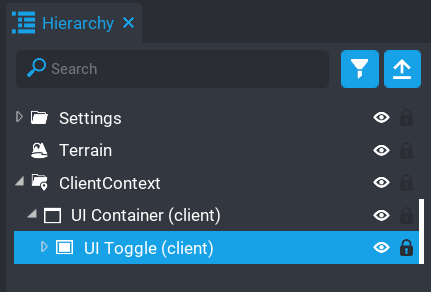

# Context

It's good habit to put all your UI into a Client Context.  The Server doesn't need to know about the UI components, client side scripts should be used for updating the UI.

The `UI Toggle` component will throw an error if it's not in a Client Context as there is a client script that handles setup and events.

More information on [Contexts](https://docs.coregames.com/api/contexts/#contexts)