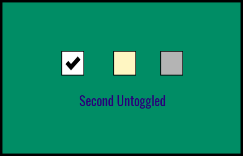

# Example

The `UI Toggle` component comes with a working example that shows you a simple setup along with an example of how to use the events system.

Drag and drop the `UI Toggle Example` template into your hierarchy.  This example already has a client context and UI container setup.

Enter play mode and test the 3 toggles.  Toggle 3 is disabled and only enabled when toggle 2 is enabled.



## Example Script

```lua
-- Text UI components to show what was checked

local text_box = script:GetCustomProperty("text_box"):WaitForObject()

-- First toggle event

Events.Connect("on_first_toggled", function(state)
	if(state) then
		text_box.text = "First Toggled"
	else
		text_box.text = "First Untoggled"
	end
end)

-- Second toggle event
-- This toggle enables / disables the third toggle

Events.Connect("on_second_toggled", function(state)
	if(state) then
		text_box.text = "Second Toggled"
		Events.Broadcast("on_third_enable")
	else
		text_box.text = "Second Untoggled"
		Events.Broadcast("on_third_disable")
	end
end)

-- Third toggle event

Events.Connect("on_third_toggled", function(state)
	if(state) then
		text_box.text = "Third Toggled"
	else
		text_box.text = "Third Untoggled"
	end
end)

-- Grab the local player

local local_player = Game.GetLocalPlayer()

-- Show cursor and allow UI to be intereacted with on player join.

Game.playerJoinedEvent:Connect(function()
	UI.SetCursorVisible(true)
	UI.SetCanCursorInteractWithUI(true)
end)
```