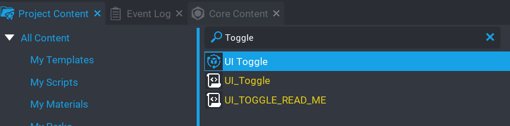

# Add to Hierarchy

Before you can use the component, you will need to place it into your hierarchy.

In the `Project Content` window, find the `UI Toggle` component.

  
Drag the component into your hierarchy which should now contain the component like so.

