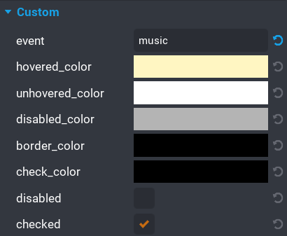

# Properties

The `UI Toggle` component comes with quite a few properties that allow for easy customisation.

| Property Name | Description |
| ------------- | ----------- |
| `event` | A unique event can be set for broadcasting and listening.  See the [Events](/events) section for more information. |
| `hovered_color ` | The color of the toggle when the mouse is hovered over them. |
| `unhovered_color` | The color of the toggle when the mouse moves off it.  This is the default color. |
| `disabled_color` | The color of the toggle when it is disabled. |
| `border_color` | The color of the border around the toggle. |
| `check_color` | The color of the checkmark. |
| `disabled` | _(boolean)_ If enabled then the toggle will be disabled at runtime. |
| `checked` | _(boolean)_ If enabled then the toggle will be checked at runtime. |